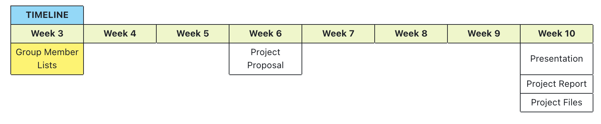

# STA 141C Final Project
**Authors**: wait for updates
> **Note**
>
> * **Proposal**: [Overleaf](https://www.overleaf.com/9511722223kbdqxmwybcfd), [Google Doc](https://docs.google.com/document/d/1dcO3OXuVgp5WP37fM8YsEkzJwXTj8SWeJz0VrOypLmI/edit?usp=sharing)
> * **Report Link**: [Overleaf](https://www.overleaf.com/3624512345cpgpgkhmhhgz), [Google Doc](https://docs.google.com/document/d/1O6-xgb9vxj_4k-UZL5II3unEeGhPr-5oWcNJRvrE7CU/edit?usp=sharing)
> * **Presentation**: [Click]()

- [STA 141C Final Project](#sta-141c-final-project)
  - [Final Project Details](#final-project-details)
    - [Grade Distributions](#grade-distributions)

## Final Project Details

### Grade Distributions
* **Final Project Proposal (5%)** At the end of the **6th** Week, each team need to submit a project proposal.
* **Final Presentation (10%)** In week 10, each group will present preliminary results from their project to the class. Each group can either elect a leader to present results or choose to let everyone in the team to present. You are required attend and provide feedback on presentations from some of the other teams. More details about presentations will be released in **Week 8**.
* **Final Project (25%)** For the final project, you will work in teams of 3-5 people.